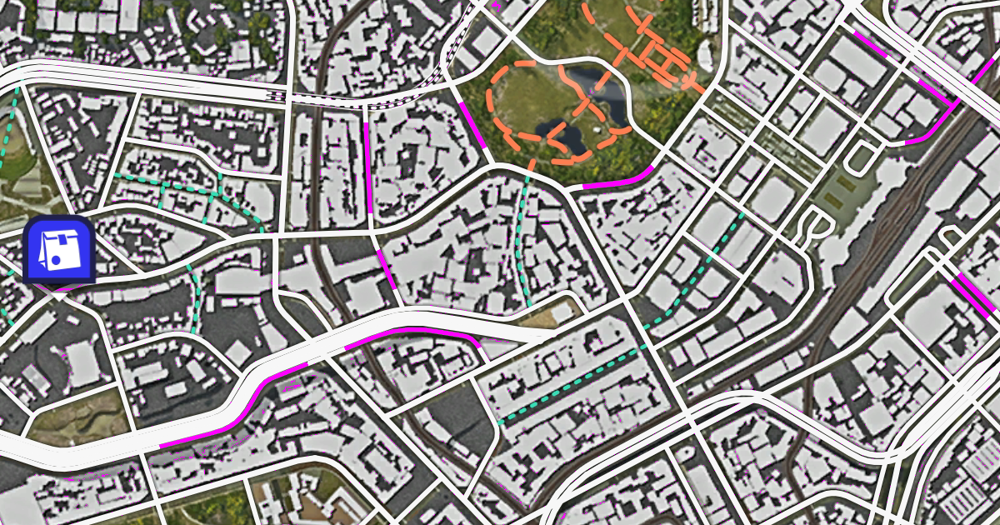

# Forza Road Finder



A lightweight browser tool for locating undiscovered roads in **Forza Horizon 6**.

Undiscovered roads render in a distinct grey (`#808080`). This page captures your screen via the browser's Screen Share API and replaces that colour with bright magenta (`#FF00FF`) in real time, making unvisited roads immediately visible on the in-game map.

## Usage

> **Note:** If you're reading this in the in-app Help panel, the app is already running — skip ahead to the Controls section below.

1. Clone the repository and install dependencies:
   ```
   npm install
   ```
2. Build the app:
   ```
   npm run build
   ```
3. Serve the `dist/` directory with any static file server and open it in your browser.
4. Click **Share Screen** and select your Forza Horizon 6 window.
5. Grey undiscovered roads will be highlighted in magenta on the canvas.

For local development with live reload, use `npm run dev` instead of building.

## Controls

| Control | Description |
|---------|-------------|
| **Share Screen** | Requests screen-capture permission and starts processing |
| **Pause / Resume** | Freezes the frame loop without stopping the stream |
| **Stop** | Ends the capture and releases the stream |
| **Save Image** | Exports the current processed frame as a full-resolution timestamped PNG |
| **100% Scale / Fit to Window** | Toggles between native resolution (scrollable) and scaled-to-fit view |
| **ⓘ Help** | Opens this readme |
| **Find** color | The colour to search for in each frame (default `#808080`) |
| **Replace** color | The colour to substitute in (default `#FF00FF`) |
| **FPS** (0.1 – 30) | Frame rate of the processing loop (default 1 FPS) |
| **Tolerance** (0 – 40) | Per-channel colour tolerance to account for capture compression (default 5) |

## Privacy

All screen capture and image processing happens entirely in your browser. No video, pixel data, or any other information is ever sent to a server or third party.

## Offline / PWA support

The app installs as a Progressive Web App and works fully offline after the first visit. All assets — including the `marked` Markdown parser — are bundled at build time, so there is no runtime dependency on any CDN or external network.

## Performance notes

- The canvas context is created with `willReadFrequently: true` to keep pixel data in CPU memory and avoid GPU readback on every frame.
- At tolerance = 0 a fast `Uint32Array` path is used (one comparison per pixel).
- At tolerance > 0 each channel is compared individually with `Math.abs`.
- Colour values are parsed once on change and cached; `processFrame` does no string parsing.
- Frames are scheduled with `setTimeout` rather than `requestAnimationFrame` so the low FPS limit is respected precisely.
- Up to 1440p (2560×1440) capture resolution is requested from the browser.

## Browser support

Any modern Chromium-based browser (Chrome, Edge) or Firefox that supports the [Screen Capture API](https://developer.mozilla.org/en-US/docs/Web/API/Screen_Capture_API/Using_Screen_Capture).
